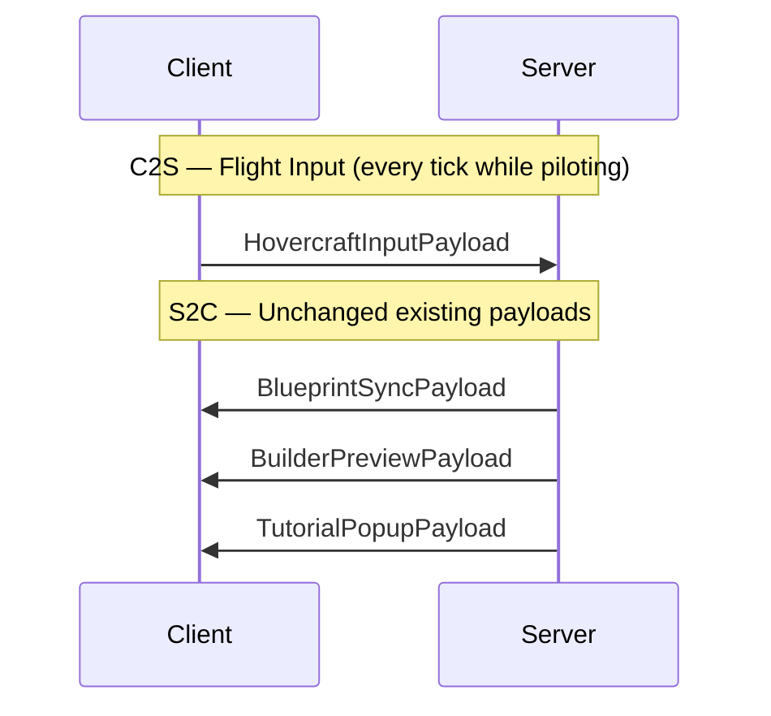
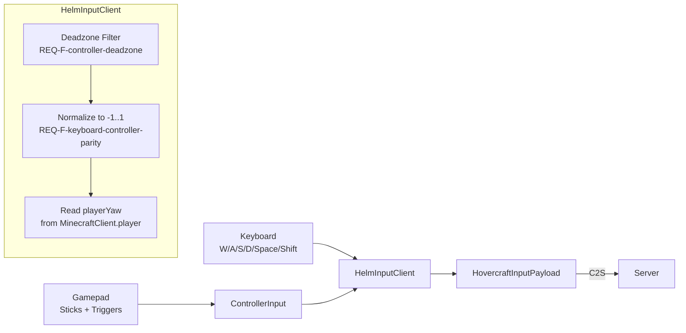

# API Design — C2S / S2C Networking Protocol

## Overview

The hovercraft refactor modifies the client-to-server (C2S) input channel and leaves the existing server-to-client (S2C) channels unchanged. All payloads use Fabric's `CustomPayload` system registered in `ModNetworking`.



## C2S Payloads

### HovercraftInputPayload (NEW — replaces HelmInputPayload)

**Purpose:** Transmits the pilot's flight input from client to server each tick while mounted on a vehicle.

**Identifier:** `sharkengine:hovercraft_input`

**Fields:**

| Field | Type | Bytes | Range | Description |
|-------|------|-------|-------|-------------|
| `moveForward` | `float` | 4 | `[-1.0 .. 1.0]` | Forward/backward axis (`REQ-F-input-model`) |
| `moveStrafe` | `float` | 4 | `[-1.0 .. 1.0]` | Left/right strafe axis (`REQ-F-input-model`) |
| `moveVertical` | `float` | 4 | `[-1.0 .. 1.0]` | Up/down axis (`REQ-F-input-model`) |
| `playerYaw` | `float` | 4 | `[0 .. 360)` | Pilot's horizontal look direction |

**Total size:** 16 bytes per packet.

**Serialization:**

```java
// Write (client)
buf.writeFloat(moveForward);
buf.writeFloat(moveStrafe);
buf.writeFloat(moveVertical);
buf.writeFloat(playerYaw);

// Read (server)
float moveForward = buf.readFloat();
float moveStrafe  = buf.readFloat();
float moveVertical = buf.readFloat();
float playerYaw   = buf.readFloat();
```

**Sending conditions:**
- Client is mounted on a `ShipEntity` as pilot (first passenger)
- Sent every client tick (regardless of whether input changed — server needs continuous state)

**Replaces:** `HelmInputPayload` which carried `throttle` (float), `turn` (float), `forward` (float). The `turn` field is removed entirely — yaw rotation is no longer part of the flight model.

### Server Handler

**Location:** `ModNetworking.registerServerHandlers()`

**Logic:**

```
on receive HovercraftInputPayload(fwd, strafe, vert, yaw):
    player = sender
    vehicle = player.getVehicle()
    if vehicle instanceof ShipEntity ship:
        if ship.getPilot() == player:
            // Server-side validation: clamp values to valid range
            fwd    = clamp(fwd,    -1.0, 1.0)
            strafe = clamp(strafe, -1.0, 1.0)
            vert   = clamp(vert,   -1.0, 1.0)
            yaw    = yaw % 360.0
            ship.setInputs(fwd, strafe, vert, yaw)
```

**Validation rules** (`CON-server-authoritative-physics`):
- All axis values are clamped to `[-1.0 .. 1.0]` — prevents cheating via out-of-range values
- Yaw is normalized to `[0 .. 360)` — prevents accumulation errors
- Only the pilot (first passenger) can send flight input — non-pilot payloads are silently discarded
- Vehicle must be a `ShipEntity` — payloads for non-ship entities are ignored

### Removed: HelmInputPayload

The existing `HelmInputPayload` with fields `throttle`, `turn`, `forward` is removed. All references in `ModNetworking` (registration, handler) are replaced by `HovercraftInputPayload`.

**Migration:** This is a breaking protocol change. Client and server must both run the updated mod version. No backward compatibility is needed — the mod is not yet released to production (`CON-preserve-existing-systems` applies to code systems, not wire protocol).

## S2C Payloads (UNCHANGED)

The following server-to-client payloads remain as-is. They are not affected by the hovercraft refactor:

| Payload | Purpose | Affected? |
|---------|---------|-----------|
| `BlueprintSyncPayload` | Syncs ship blueprint to client after assembly | No |
| `BuilderPreviewPayload` | Sends builder mode block highlights | No |
| `TutorialPopupPayload` | Triggers tutorial popup stages | No |

No new S2C payloads are introduced. The vehicle's position and velocity are synced via Minecraft's built-in entity tracking system (server updates entity position → clients receive standard entity movement packets).

## Client-Side Input Pipeline



### Keyboard Mapping

| Key | Axis | Value |
|-----|------|-------|
| `W` | `moveForward` | `+1.0` |
| `S` | `moveForward` | `-1.0` |
| `A` | `moveStrafe` | `-1.0` (left) |
| `D` | `moveStrafe` | `+1.0` (right) |
| `Space` | `moveVertical` | `+1.0` (up) |
| `Shift` | `moveVertical` | `-1.0` (down) |

Keyboard input is binary — pressed = `±1.0`, released = `0.0`. Simultaneous opposing keys (e.g., W+S) cancel to `0.0`.

### Gamepad Mapping

| Input | Axis | Value |
|-------|------|-------|
| Left stick Y | `moveForward` | `-1.0 .. +1.0` (analog) |
| Left stick X | `moveStrafe` | `-1.0 .. +1.0` (analog) |
| Right trigger | `moveVertical` | `+1.0` (up, analog) |
| Left trigger | `moveVertical` | `-1.0` (down, analog) |

**Deadzone handling** (`REQ-F-controller-deadzone`):
- Raw stick values below threshold (e.g., `0.1`) are mapped to exactly `0.0`
- Values above threshold are passed through (optionally rescaled to use the full `0.0–1.0` range above the deadzone)

**Parity** (`REQ-F-keyboard-controller-parity`):
- Both keyboard and gamepad produce values in `[-1.0 .. 1.0]` before reaching `HovercraftInputPayload`
- The `HovercraftController` receives identical value types regardless of input source

## Registration

All payloads are registered in `ModNetworking.register()` during mod initialization:

```
// Remove
PayloadTypeRegistry.playC2S().register(HelmInputPayload.ID, HelmInputPayload.CODEC)

// Add
PayloadTypeRegistry.playC2S().register(HovercraftInputPayload.ID, HovercraftInputPayload.CODEC)

// S2C registrations remain unchanged
```

## Error Handling

| Scenario | Behavior |
|----------|----------|
| Payload from non-mounted player | Silently discarded |
| Payload from non-pilot passenger | Silently discarded |
| Values outside `[-1.0 .. 1.0]` | Server clamps to valid range |
| Malformed packet (wrong byte count) | Fabric's codec throws; connection not affected |
| Payload sent while vehicle has no fuel | Input stored, but `HovercraftController` produces zero acceleration |
