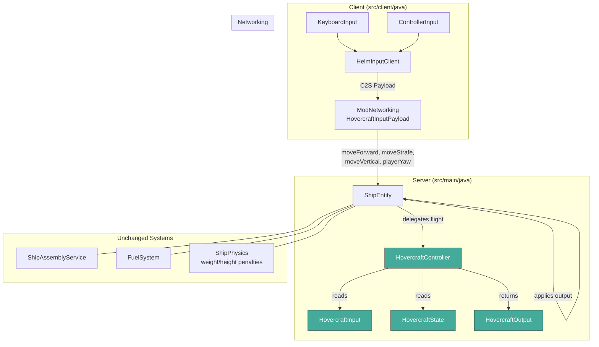
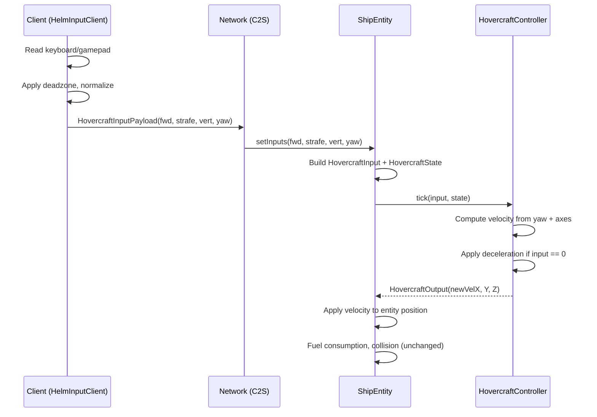

# Architecture

## Component Overview



## Components

### 1. HovercraftController (NEW — `dev.sharkengine.ship`)

Pure class with no Minecraft or Fabric imports (`REQ-MNT-hovercraft-controller-class`).

**Responsibility:** Compute the vehicle's new velocity from player input and current state.

**Method:** `HovercraftOutput tick(HovercraftInput input, HovercraftState state)`

**Behavior:**
- Derives horizontal movement vector from `playerYawDeg` and `moveForward`/`moveStrafe` (`REQ-F-forward-by-player-yaw`, `REQ-F-strafe-movement`)
- `moveForward` accepts `[-1..1]` — negative values produce backward movement (`REQ-F-backward-movement`)
- `moveVertical` affects only Y velocity; pitch is ignored (`REQ-F-vertical-only`)
- Zero input produces zero acceleration and no drift (`REQ-F-no-drift-neutral`)
- When all inputs are zero, applies friction decay to existing velocity — full stop within 10 ticks (`REQ-F-controlled-deceleration`)
- Combined multi-axis input produces the correct vector sum; no axis suppresses another
- Speed is capped by weight category (from `HovercraftState`)

**Design constraints:**
- No `net.minecraft.*` or `net.fabricmc.*` imports
- No object allocations in the tick hot path (`REQ-PERF-controller-tick-budget`)
- Deterministic: same input + state always produces the same output

### 2. HovercraftInput (NEW — `dev.sharkengine.ship`)

Immutable data class carrying one tick's worth of player input (`REQ-F-input-model`).

**Fields:**
- `float moveForward` — range `[-1..1]`, forward/backward along player yaw
- `float moveStrafe` — range `[-1..1]`, left/right orthogonal to player yaw
- `float moveVertical` — range `[-1..1]`, up/down on Y axis
- `float playerYawDeg` — player's current horizontal look direction in degrees

No `turn` channel — removed from the flight input model.

### 3. HovercraftState (NEW — `dev.sharkengine.ship`)

Snapshot of the vehicle's current physical state, read by the controller.

**Fields:**
- `float velX, velY, velZ` — current velocity vector
- `WeightCategory weightCategory` — LIGHT, MEDIUM, HEAVY, OVERLOADED (determines max speed)
- `float fuelLevel` — current fuel (affects whether movement is allowed)

### 4. HovercraftOutput (NEW — `dev.sharkengine.ship`)

Result of one tick's computation, applied by `ShipEntity`.

**Fields:**
- `float newVelX, newVelY, newVelZ` — velocity vector for the next tick

### 5. ShipEntity (MODIFIED — `dev.sharkengine.ship`)

**Changes:**
- `tick()` builds `HovercraftInput` from stored input values + pilot's yaw via `((PlayerEntity) getFirstPassenger()).getYaw()` (`ASM-player-yaw-server-accessible`)
- `tick()` builds `HovercraftState` from current entity velocity, weight category, and fuel level
- `tick()` calls `HovercraftController.tick(input, state)` and applies the returned `HovercraftOutput` to entity velocity (`REQ-MNT-ship-entity-delegates`)
- `setInputs(...)` stores `moveForward`, `moveStrafe`, `moveVertical` instead of `forward`, `turn`, `vertical` — clamp removed for `moveForward` to allow `[-1..1]` (`REQ-F-backward-movement`)
- BUG-block facing stored for model orientation only — not used to derive flight direction (`REQ-F-bugblock-orientation-only`)

**Unchanged:** Assembly lifecycle, fuel consumption, mounting/dismounting, collision, weight/height penalties (`CON-preserve-existing-systems`)

### 6. HelmInputClient (MODIFIED — `dev.sharkengine.client`)

**Changes:**
- Captures `moveForward`, `moveStrafe`, `moveVertical` from keyboard/gamepad instead of `forward`, `turn`, `vertical`
- Applies deadzone filtering before sending — stick values below threshold become exactly 0.0 (`REQ-F-controller-deadzone`)
- Normalizes keyboard and gamepad input to identical value ranges before transmission (`REQ-F-keyboard-controller-parity`)
- Sends `playerYaw` (from `MinecraftClient.getInstance().player.getYaw()`) with each payload

**Removed:** `turn` channel — yaw rotation is no longer part of the flight input model

### 7. ModNetworking (MODIFIED — `dev.sharkengine.net`)

**Changes:**
- New payload: `HovercraftInputPayload(float moveForward, float moveStrafe, float moveVertical, float playerYaw)`
- Replaces existing `HelmInputPayload` for flight input
- Server handler stores values on `ShipEntity` via `setInputs()`

## Data Flow Per Tick



## Deceleration Model

When all inputs are zero, the controller applies a friction multiplier per tick to the existing velocity:

```
friction = 0.4  (tuning constant — produces full stop in ~8 ticks from max speed)
newVel = currentVel * friction
if |newVel| < 0.001: newVel = 0
```

This ensures:
- Monotonic speed decrease — no oscillation (`REQ-F-controlled-deceleration`)
- Full stop within 10 ticks from max speed (`REQ-F-controlled-deceleration`)
- No residual drift after stopping (`REQ-F-no-drift-neutral`)

## Movement Vector Computation

The horizontal movement vector is derived from player yaw:

```
yawRad = playerYawDeg * (PI / 180)
forwardX = -sin(yawRad)
forwardZ =  cos(yawRad)
strafeX  =  cos(yawRad)
strafeZ  =  sin(yawRad)

horizontalVel = (moveForward * forwardVec) + (moveStrafe * strafeVec)
verticalVel = moveVertical * verticalSpeed

// Normalize if combined magnitude > 1.0 to prevent diagonal speed boost
if |horizontalVel| > 1.0: horizontalVel = normalize(horizontalVel)
```

This satisfies:
- Forward follows player yaw (`REQ-F-forward-by-player-yaw`)
- Backward is exact opposite (`REQ-F-backward-movement`)
- Strafe is orthogonal (`REQ-F-strafe-movement`)
- Vertical is Y-only (`REQ-F-vertical-only`)
- No axis dominates in combination

## Requirement Coverage

| Requirement | Addressed by |
|-------------|-------------|
| `REQ-F-input-model` | HovercraftInput, HelmInputClient, ModNetworking |
| `REQ-F-forward-by-player-yaw` | HovercraftController (yaw → forward vector) |
| `REQ-F-backward-movement` | HovercraftController (moveForward accepts -1) |
| `REQ-F-strafe-movement` | HovercraftController (orthogonal to yaw) |
| `REQ-F-vertical-only` | HovercraftController (Y-axis isolated) |
| `REQ-F-no-drift-neutral` | HovercraftController (zero output for zero input) |
| `REQ-F-controlled-deceleration` | HovercraftController (friction decay, 10 ticks) |
| `REQ-F-bugblock-orientation-only` | ShipEntity (BUG-facing decoupled from flight) |
| `REQ-F-controller-deadzone` | HelmInputClient / ControllerInput |
| `REQ-F-keyboard-controller-parity` | HelmInputClient (normalization before send) |
| `REQ-MNT-hovercraft-controller-class` | HovercraftController (no MC imports) |
| `REQ-MNT-ship-entity-delegates` | ShipEntity.tick() delegates to controller |
| `REQ-MNT-flight-behavior-test-suite` | Tests A–J against HovercraftController directly |
| `REQ-REL-no-regression` | Unchanged systems preserved |
| `REQ-COMP-fabric-api-compatibility` | All new classes use only Java stdlib |
| `REQ-PERF-controller-tick-budget` | Pure math, no allocations in hot path |

## Constraint Compliance

| Constraint | Status |
|-----------|--------|
| `CON-fabric-minecraft-1-21-1` | Compliant — HovercraftController has no MC imports; ShipEntity uses Fabric 1.21.1 APIs as before |
| `CON-server-authoritative-physics` | Compliant — controller runs server-side; client sends input only |
| `CON-preserve-existing-systems` | Compliant — assembly, fuel, mounting unchanged |

## Assumption Risks

| Assumption | Status | Risk | Mitigation |
|-----------|--------|------|-----------|
| `ASM-player-yaw-server-accessible` | Unverified | High | Verify in early Code phase by reading `ShipEntity.java` passenger access |
| `ASM-stable-tick-rate` | Unverified | Medium | Acceptable for target use case (single-player / light multiplayer) |
| `ASM-controller-input-stack-reusable` | Unverified | Medium | Design assumes bounded changes to HelmInputClient; verify during implementation |
