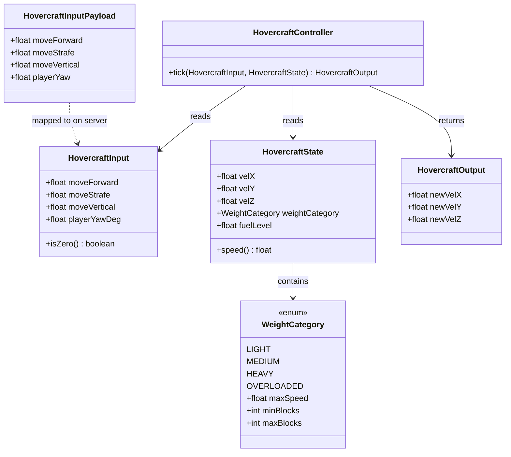

# Data Model

## Overview

The hovercraft flight system introduces four new data structures and modifies one existing networking payload. All new types live in `dev.sharkengine.ship` and have no Minecraft/Fabric dependencies (`REQ-MNT-hovercraft-controller-class`).



## Data Structures

### HovercraftInput

Immutable value object carrying one tick's player input (`REQ-F-input-model`).

| Field | Type | Range | Description |
|-------|------|-------|-------------|
| `moveForward` | `float` | `[-1.0 .. 1.0]` | Forward (+) / backward (-) along player yaw (`REQ-F-forward-by-player-yaw`, `REQ-F-backward-movement`) |
| `moveStrafe` | `float` | `[-1.0 .. 1.0]` | Left (-) / right (+) orthogonal to player yaw (`REQ-F-strafe-movement`) |
| `moveVertical` | `float` | `[-1.0 .. 1.0]` | Up (+) / down (-) on Y axis only (`REQ-F-vertical-only`) |
| `playerYawDeg` | `float` | `[0 .. 360)` | Player's horizontal look direction in degrees |

**Lifecycle:** Created each tick by `ShipEntity` from stored input values and pilot yaw. Consumed by `HovercraftController.tick()`. Not persisted.

**Helper:** `isZero()` returns `true` when all three movement axes are exactly `0.0` — used by the controller to trigger deceleration logic.

**Implementation:** Java `record` (immutable, value equality, compact).

### HovercraftState

Snapshot of the vehicle's current physical state, read by the controller.

| Field | Type | Range | Description |
|-------|------|-------|-------------|
| `velX` | `float` | unbounded | Current X velocity (blocks/tick) |
| `velY` | `float` | unbounded | Current Y velocity (blocks/tick) |
| `velZ` | `float` | unbounded | Current Z velocity (blocks/tick) |
| `weightCategory` | `WeightCategory` | enum | Determines max speed cap |
| `fuelLevel` | `float` | `[0.0 .. 100.0]` | Current fuel — if 0, controller produces zero acceleration |

**Lifecycle:** Created each tick by `ShipEntity` from entity velocity and ship properties. Consumed by `HovercraftController.tick()`. Not persisted.

**Helper:** `speed()` returns `sqrt(velX² + velY² + velZ²)` — used for speed capping and deceleration checks.

**Implementation:** Java `record`.

### HovercraftOutput

Result of one tick's flight computation, applied by `ShipEntity` to entity velocity.

| Field | Type | Range | Description |
|-------|------|-------|-------------|
| `newVelX` | `float` | bounded by max speed | New X velocity for next tick |
| `newVelY` | `float` | bounded by max speed | New Y velocity for next tick |
| `newVelZ` | `float` | bounded by max speed | New Z velocity for next tick |

**Lifecycle:** Returned by `HovercraftController.tick()`. `ShipEntity` applies values to entity velocity via `setVelocity()`. Not persisted.

**Implementation:** Java `record`.

### WeightCategory (EXISTING — modified)

Already exists in the codebase. No structural changes — only referenced by `HovercraftState`.

| Value | Block Range | Max Speed (blocks/tick) |
|-------|------------|------------------------|
| `LIGHT` | 1–20 | 1.5 |
| `MEDIUM` | 21–40 | 1.0 |
| `HEAVY` | 41–60 | 0.7 |
| `OVERLOADED` | 61+ | 0.4 |

Max speed values are existing constants from `ShipPhysics`. The controller uses `weightCategory.maxSpeed` to cap the output velocity magnitude.

### HovercraftInputPayload (MODIFIED — `dev.sharkengine.net`)

C2S networking payload replacing the existing `HelmInputPayload`.

| Field | Type | Range | Description |
|-------|------|-------|-------------|
| `moveForward` | `float` | `[-1.0 .. 1.0]` | Forward/backward axis |
| `moveStrafe` | `float` | `[-1.0 .. 1.0]` | Strafe axis |
| `moveVertical` | `float` | `[-1.0 .. 1.0]` | Vertical axis |
| `playerYaw` | `float` | `[0 .. 360)` | Player's current horizontal yaw |

**Serialization:** 4 floats = 16 bytes per packet. Written/read via Fabric's `PacketByteBuf` (`writeFloat` / `readFloat`).

**Lifecycle:** Created client-side by `HelmInputClient` each tick when piloting. Deserialized server-side by `ModNetworking` handler and stored on `ShipEntity` via `setInputs()`.

**Replaces:** The existing `HelmInputPayload` which carried `throttle`, `turn`, and `forward` fields. The `turn` field is removed entirely (`REQ-F-input-model`).

## Data Flow Summary

```
Client tick:
  keyboard/gamepad → deadzone filter → normalize → HovercraftInputPayload → C2S send

Server tick:
  C2S receive → ShipEntity.setInputs(fwd, strafe, vert, yaw)
  ShipEntity.tick():
    1. Build HovercraftInput(storedFwd, storedStrafe, storedVert, pilotYaw)
    2. Build HovercraftState(entity.velX/Y/Z, weightCategory, fuelLevel)
    3. HovercraftOutput out = controller.tick(input, state)
    4. entity.setVelocity(out.newVelX, out.newVelY, out.newVelZ)
    5. Fuel consumption, collision, etc. (unchanged)
```

## Constants

| Constant | Value | Location | Used by |
|----------|-------|----------|---------|
| `FRICTION_MULTIPLIER` | `0.7f` | `HovercraftController` | Deceleration per tick when input is zero |
| `VELOCITY_EPSILON` | `0.001f` | `HovercraftController` | Below this speed, velocity is snapped to zero |
| `DECELERATION_TICKS` | `10` | Test reference only | Expected ticks to full stop from max speed |
| `ACCELERATION_RATE` | TBD during impl | `HovercraftController` | Speed gain per tick per unit of input |
| `VERTICAL_SPEED_FACTOR` | TBD during impl | `HovercraftController` | Vertical axis speed relative to horizontal |
